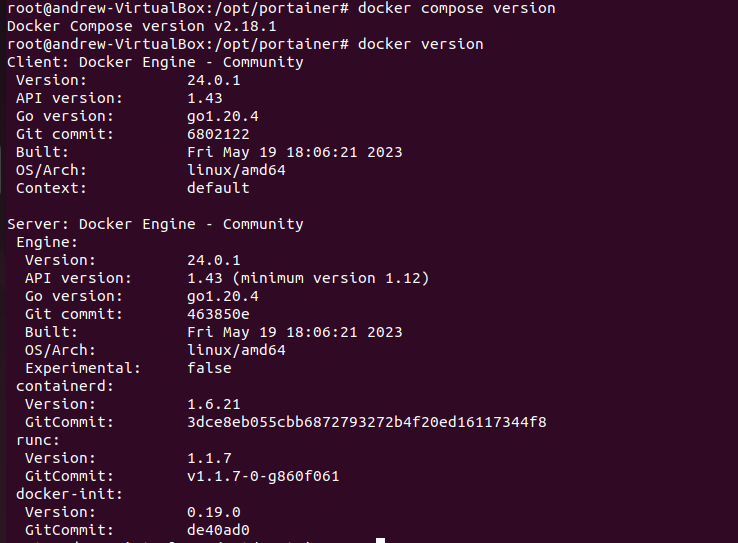
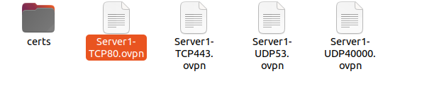
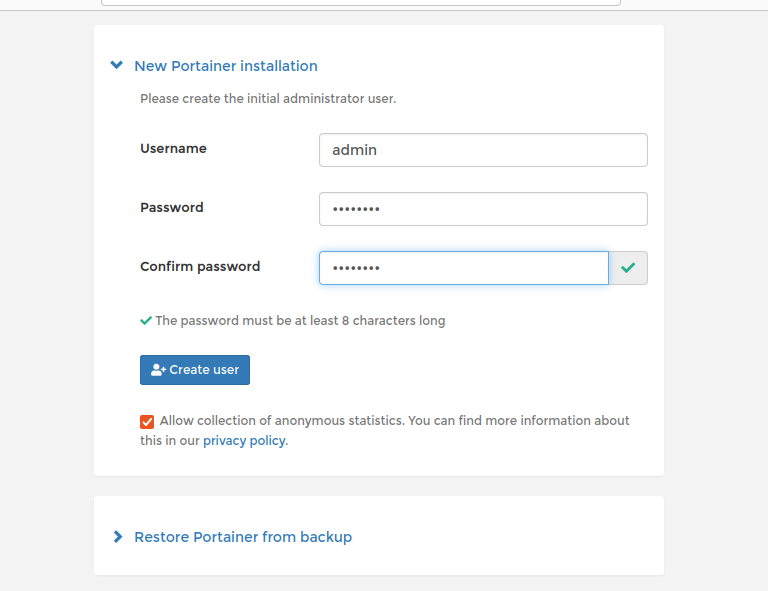
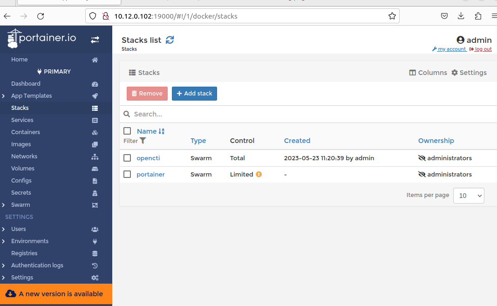
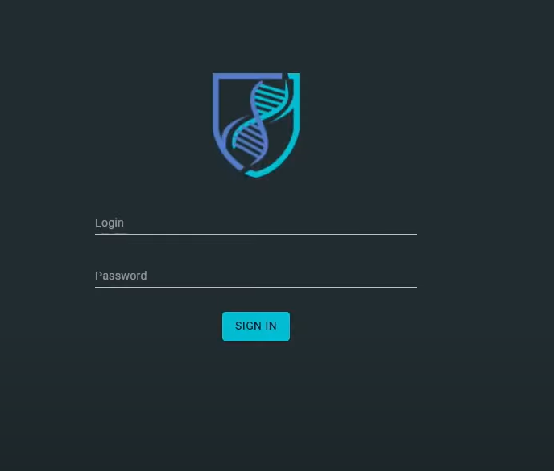
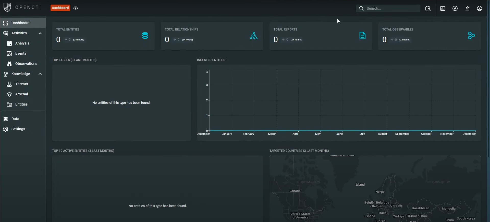

## Цель работы

1.  Освоить базовые подходы процессов Threat Intelligence
2.  Освоить современные инструменты развертывания контейнирозованных приложений
3.  Получить навыки поиска информации об угрозах ИБ

## Исходные данные

1.  Docker
2.  OpenVPN
3.  Portainer.io
4.  Ubuntu
5.  RStudio
6.  OPENCTI

## План

1.  Развернуть систему threat intelligence -- Open CTI
2.  Настроить дополнительные источники информации об угрозах ИБ
3.  Проверить наличие индикаторов компрометации в собранном в ПР №3 наборе данных
4.  Оформить отчет

## Описание шагов:

1.  Устанавливаем Docker и Docker-compose\
    \

2.  Использовать OpenVPN для работы с OPENCTI, основанной на elasticsearch

    

> sudo apt install openvpn

> sudo openvpn --config Server1-TCP80.ovpn

3.  Устанавливаем OpenCTI

Устанавливаем докеру non root user

> sudo usermod -aG docker \$USER

Настраиваем докеру Swarm


> docker swarm init --advertise-addr 10.12.0.102

4.  Устанавливаем Portainer

> mkdir -p /opt/portainer && cd /opt/portainer

> curl -L https://downloads.portainer.io/portainer-agent-stack.yml -o portainer-agent-stack.yml

Меняем в portainer-agent-stack.yml порты,чтобы они не конфликтовали с OpenCTI

9000-\>19000 8000-\>18000

Запускаем Portainer

> docker stack deploy --compose-file=portainer-agent-stack.yml portainer

Заходим на Portainer



5.  Устанавливаем OpenCTI на Portainer

    Настроиваем docker-compose.yml копируя с официального сайта

```{=pdf}
    version: '3'
    services:
      redis:
        image: redis:7.0.11
        restart: always
        volumes:
          - redisdata:/data
      elasticsearch:
        image: docker.elastic.co/elasticsearch/elasticsearch:8.7.1
        volumes:
          - esdata:/usr/share/elasticsearch/data
        environment:
          # Comment out the line below for single-node
          - discovery.type=single-node
          # Uncomment line below below for a cluster of multiple nodes
          # - cluster.name=docker-cluster
          - xpack.ml.enabled=false
          - xpack.security.enabled=false
          - "ES_JAVA_OPTS=-Xms${ELASTIC_MEMORY_SIZE} -Xmx${ELASTIC_MEMORY_SIZE}"
        restart: always
        ulimits:
          memlock:
            soft: -1
            hard: -1
          nofile:
            soft: 65536
            hard: 65536
      minio:
        image: minio/minio:RELEASE.2023-05-18T00-05-36Z
        volumes:
          - s3data:/data
        ports:
          - "9000:9000"
        environment:
          MINIO_ROOT_USER: ${MINIO_ROOT_USER}
          MINIO_ROOT_PASSWORD: ${MINIO_ROOT_PASSWORD}    
        command: server /data
        healthcheck:
          test: ["CMD", "curl", "-f", "http://localhost:9000/minio/health/live"]
          interval: 30s
          timeout: 20s
          retries: 3
        restart: always
      rabbitmq:
        image: rabbitmq:3.11-management
        environment:
          - RABBITMQ_DEFAULT_USER=${RABBITMQ_DEFAULT_USER}
          - RABBITMQ_DEFAULT_PASS=${RABBITMQ_DEFAULT_PASS}
        volumes:
          - amqpdata:/var/lib/rabbitmq
        restart: always
      opencti:
        image: opencti/platform:5.7.6
        environment:
          - NODE_OPTIONS=--max-old-space-size=8096
          - APP__PORT=8080
          - APP__BASE_URL=${OPENCTI_BASE_URL}
          - APP__ADMIN__EMAIL=${OPENCTI_ADMIN_EMAIL}
          - APP__ADMIN__PASSWORD=${OPENCTI_ADMIN_PASSWORD}
          - APP__ADMIN__TOKEN=${OPENCTI_ADMIN_TOKEN}
          - APP__APP_LOGS__LOGS_LEVEL=error
          - REDIS__HOSTNAME=redis
          - REDIS__PORT=6379
          - ELASTICSEARCH__URL=http://elasticsearch:9200
          - MINIO__ENDPOINT=minio
          - MINIO__PORT=9000
          - MINIO__USE_SSL=false
          - MINIO__ACCESS_KEY=${MINIO_ROOT_USER}
          - MINIO__SECRET_KEY=${MINIO_ROOT_PASSWORD}
          - RABBITMQ__HOSTNAME=rabbitmq
          - RABBITMQ__PORT=5672
          - RABBITMQ__PORT_MANAGEMENT=15672
          - RABBITMQ__MANAGEMENT_SSL=false
          - RABBITMQ__USERNAME=${RABBITMQ_DEFAULT_USER}
          - RABBITMQ__PASSWORD=${RABBITMQ_DEFAULT_PASS}
          - SMTP__HOSTNAME=${SMTP_HOSTNAME}
          - SMTP__PORT=25
          - PROVIDERS__LOCAL__STRATEGY=LocalStrategy
        ports:
          - "8080:8080"
        depends_on:
          - redis
          - elasticsearch
          - minio
          - rabbitmq
        restart: always
      worker:
        image: opencti/worker:5.7.6
        environment:
          - OPENCTI_URL=http://opencti:8080
          - OPENCTI_TOKEN=${OPENCTI_ADMIN_TOKEN}
          - WORKER_LOG_LEVEL=info
        depends_on:
          - opencti
        deploy:
          mode: replicated
          replicas: 3
        restart: always
      connector-export-file-stix:
        image: opencti/connector-export-file-stix:5.7.6
        environment:
          - OPENCTI_URL=http://opencti:8080
          - OPENCTI_TOKEN=${OPENCTI_ADMIN_TOKEN}
          - CONNECTOR_ID=${CONNECTOR_EXPORT_FILE_STIX_ID} # Valid UUIDv4
          - CONNECTOR_TYPE=INTERNAL_EXPORT_FILE
          - CONNECTOR_NAME=ExportFileStix2
          - CONNECTOR_SCOPE=application/json
          - CONNECTOR_CONFIDENCE_LEVEL=15 # From 0 (Unknown) to 100 (Fully trusted)
          - CONNECTOR_LOG_LEVEL=info
        restart: always
        depends_on:
          - opencti
      connector-export-file-csv:
        image: opencti/connector-export-file-csv:5.7.6
        environment:
          - OPENCTI_URL=http://opencti:8080
          - OPENCTI_TOKEN=${OPENCTI_ADMIN_TOKEN}
          - CONNECTOR_ID=${CONNECTOR_EXPORT_FILE_CSV_ID} # Valid UUIDv4
          - CONNECTOR_TYPE=INTERNAL_EXPORT_FILE
          - CONNECTOR_NAME=ExportFileCsv
          - CONNECTOR_SCOPE=text/csv
          - CONNECTOR_CONFIDENCE_LEVEL=15 # From 0 (Unknown) to 100 (Fully trusted)
          - CONNECTOR_LOG_LEVEL=info
        restart: always
        depends_on:
          - opencti
      connector-export-file-txt:
        image: opencti/connector-export-file-txt:5.7.6
        environment:
          - OPENCTI_URL=http://opencti:8080
          - OPENCTI_TOKEN=${OPENCTI_ADMIN_TOKEN}
          - CONNECTOR_ID=${CONNECTOR_EXPORT_FILE_TXT_ID} # Valid UUIDv4
          - CONNECTOR_TYPE=INTERNAL_EXPORT_FILE
          - CONNECTOR_NAME=ExportFileTxt
          - CONNECTOR_SCOPE=text/plain
          - CONNECTOR_CONFIDENCE_LEVEL=15 # From 0 (Unknown) to 100 (Fully trusted)
          - CONNECTOR_LOG_LEVEL=info
        restart: always
        depends_on:
          - opencti
      connector-import-file-stix:
        image: opencti/connector-import-file-stix:5.7.6
        environment:
          - OPENCTI_URL=http://opencti:8080
          - OPENCTI_TOKEN=${OPENCTI_ADMIN_TOKEN}
          - CONNECTOR_ID=${CONNECTOR_IMPORT_FILE_STIX_ID} # Valid UUIDv4
          - CONNECTOR_TYPE=INTERNAL_IMPORT_FILE
          - CONNECTOR_NAME=ImportFileStix
          - CONNECTOR_VALIDATE_BEFORE_IMPORT=true # Validate any bundle before import
          - CONNECTOR_SCOPE=application/json,text/xml
          - CONNECTOR_AUTO=true # Enable/disable auto-import of file
          - CONNECTOR_CONFIDENCE_LEVEL=15 # From 0 (Unknown) to 100 (Fully trusted)
          - CONNECTOR_LOG_LEVEL=info
        restart: always
        depends_on:
          - opencti
      connector-import-document:
        image: opencti/connector-import-document:5.7.6
        environment:
          - OPENCTI_URL=http://opencti:8080
          - OPENCTI_TOKEN=${OPENCTI_ADMIN_TOKEN}
          - CONNECTOR_ID=${CONNECTOR_IMPORT_DOCUMENT_ID} # Valid UUIDv4
          - CONNECTOR_TYPE=INTERNAL_IMPORT_FILE
          - CONNECTOR_NAME=ImportDocument
          - CONNECTOR_VALIDATE_BEFORE_IMPORT=true # Validate any bundle before import
          - CONNECTOR_SCOPE=application/pdf,text/plain,text/html
          - CONNECTOR_AUTO=true # Enable/disable auto-import of file
          - CONNECTOR_ONLY_CONTEXTUAL=false # Only extract data related to an entity (a report, a threat actor, etc.)
          - CONNECTOR_CONFIDENCE_LEVEL=15 # From 0 (Unknown) to 100 (Fully trusted)
          - CONNECTOR_LOG_LEVEL=info
          - IMPORT_DOCUMENT_CREATE_INDICATOR=true
        restart: always
        depends_on:
          - opencti

    volumes:
      esdata:
      s3data:
      redisdata:
      amqpdata:
```
Настроиваем opencti.env

```{=pdf}
OPENCTI_ADMIN_EMAIL=info@opensecure.co
OPENCTI_ADMIN_PASSWORD=123a
OPENCTI_ADMIN_TOKEN=013f73d5-e828-481b-bebd-ace21a66305e
OPENCTI_BASE_URL=http://localhost:8080
MINIO_ROOT_USER=admin
MINIO_ROOT_PASSWORD=123a
RABBITMQ_DEFAULT_USER=opencti
RABBITMQ_DEFAULT_PASS=changeme
CONNECTOR_EXPORT_FILE_STIX_ID=9612a3b0-0b06-4891-9820-4f9472da3810
CONNECTOR_EXPORT_FILE_CSV_ID=10f4b726-3b22-4470-9d86-caa92691370d
CONNECTOR_EXPORT_FILE_TXT_ID=dbe1157f-52b3-4585-b944-d33dfbc4e652
CONNECTOR_IMPORT_FILE_STIX_ID=6b506a3d-18d8-42b5-8b1c-1b5e66b7efd5
CONNECTOR_IMPORT_DOCUMENT_ID=0ce44ab3-3e52-4baa-b9ac-10f2fd04f3fe
```


6.  Заходим на :8080 (Opencti)\
    

7.  Берем старые данные и добавляем новые, чтобы проанализировать количество нежелательных доменов\
    dns.log\
    Репрозиторий: [GitHub - openctibr/threatFeeds: OpenCTI.BR ThreatFeeds Public Repository](https://github.com/openctibr/threatFeeds) \
    Vrednie.txt\
    Проверяем на нежелательность и получаем результат во вкладке Reports:\
    \
    

    Итоговое число таких доменов: **23**

## Оценка результатов

Задача решена с помощью Portainer.io, Docker и OpenCTI. Я получил практические навыки развертывания контейнирозованных приложений и работы с OpenCTI

## Вывод

В данной работе я познакомился с OpenCTI, поработал с Docker и Portainer.io. Таким образом, я освоил навыки поиска информации об угрозах ИБ
