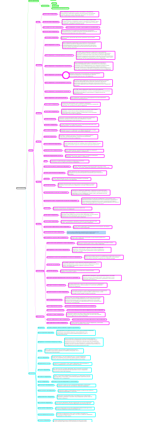

## Цель работы

1.  Познакомиться с программой Freeplane
2.  Создать mindmap на основе ГОСТ Р 50922-2006

## Исходные данные

1.  ОС Windows
2.  Freeplane
3.  ГОСТ Р 50922-2006
4.  RStudio

## План

1.  Создать mindmap
2.  Создать отчет

## Описание шагов:

1.  Используя программу Freeplane создаем mindmap по ГОСТУ Р 50922-2006 (ПДФ файл) и получаем удобную визуализацию ГОСТ-а для изучения\
    \
    
2.  Создаем отцет в RStudio

## Оценка результатов

Задача выполнена при помощи приложения Freeplane, удалось познакомится с его функционалом и особенностями.

## Вывод

В данной работе я смог создать mindmap по ГОСТУ Р 50922-2006 и понял плюсы использования Freeplane при изучении документации.
